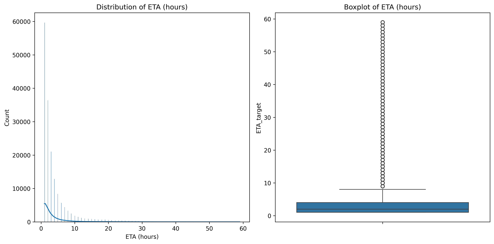
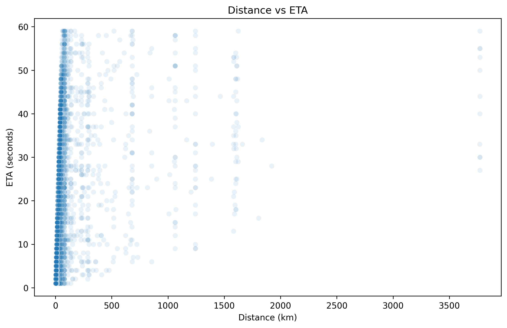
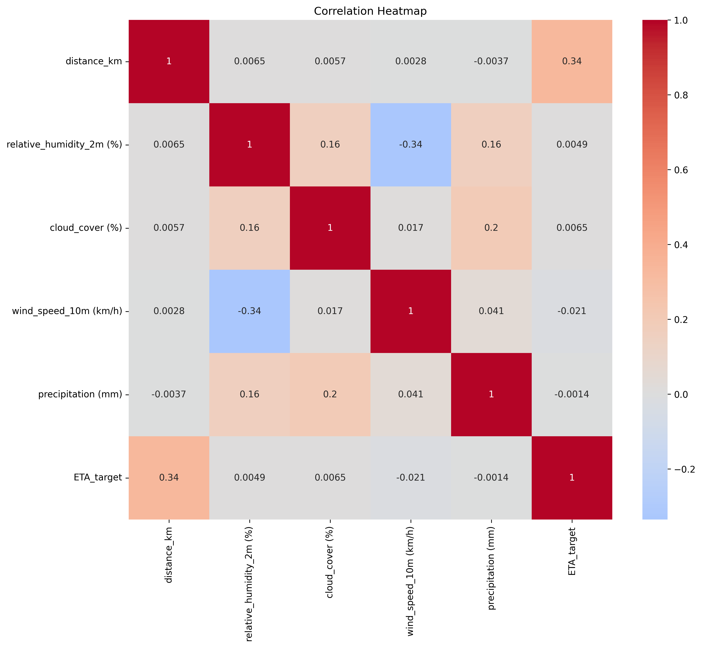
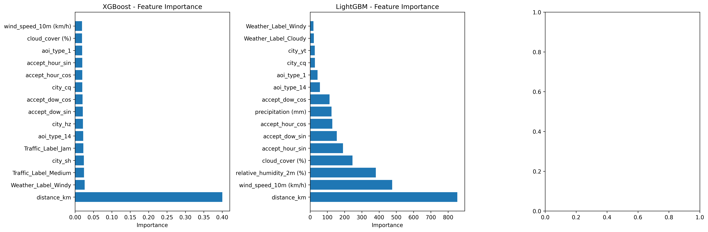
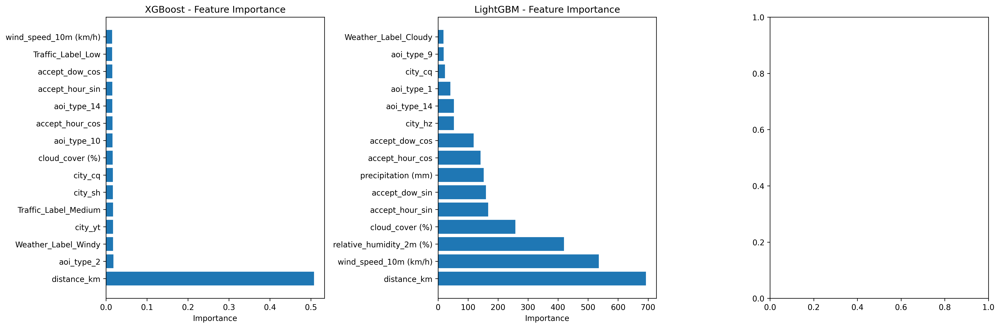
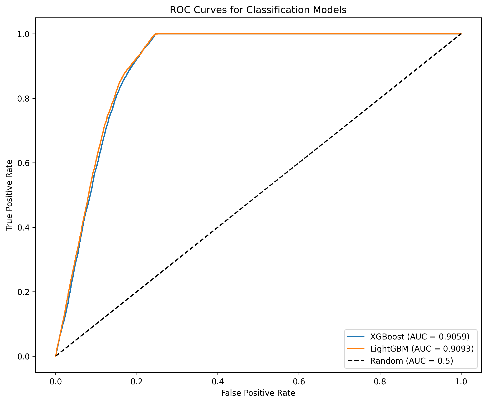
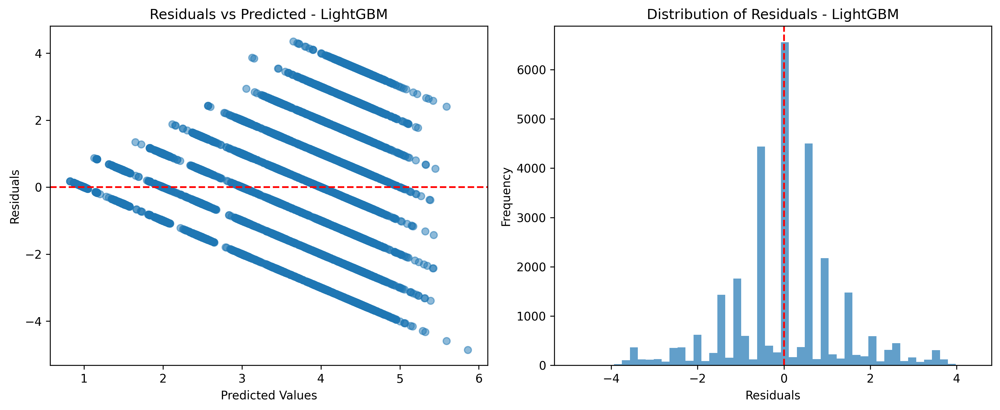
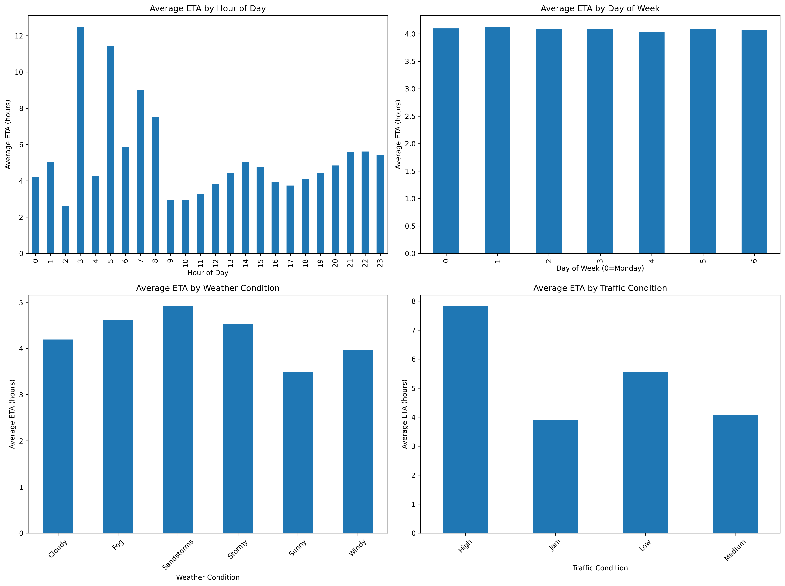
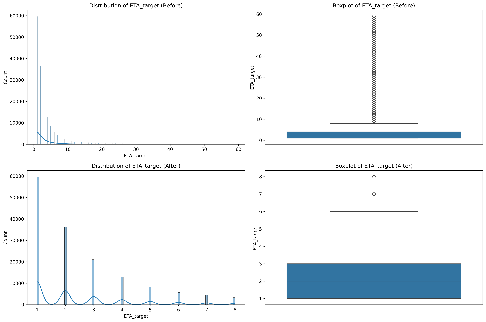

# 🚚 NexusDrive

<div align="center">

### Real-Time Delivery ETA Prediction and Delay Risk Analytics Model

[](https://www.python.org/)
[](https://fastapi.tiangolo.com/)
[](https://mlflow.org/)
[](https://www.docker.com/)
[](LICENSE)

**Machine learning–driven analytics system** for predicting delivery ETAs and classifying delay risks in real time.

[Features](#-key-features) • [Installation](#-installation--setup) • [API Documentation](#-api-documentation) • [Visualizations](#-data-visualizations) • [Deployment](#-docker-deployment)

</div>

---

## 📋 Table of Contents

- [Overview](#-project-overview)
- [Key Features](#-key-features)
- [Tech Stack](#-tech-stack)
- [Installation & Setup](#-installation--setup)
- [MLflow Experiment Tracking](#-mlflow-experiment-tracking)
- [Data Visualizations](#-data-visualizations)
- [API Documentation](#-api-documentation)
- [Docker Deployment](#-docker-deployment)
- [Testing](#-testing)
- [Project Structure](#-project-structure)
- [Model Lifecycle](#-model-lifecycle)
- [Datasets](#-datasets)
- [Weather Labeling Rules](#-weather-labeling-rules)
- [Contributing](#-contributing)
- [Author](#-author)

---

## 🧠 Project Overview

NexusDrive is a **production-ready machine learning system** that predicts **delivery Estimated Time of Arrival (ETA)** and classifies **delay risk** in real time. It integrates weather, traffic, and logistics data, using an optimized ML pipeline served via a **FastAPI + Dockerized microservice**, with **Redis caching** for fast inference and **MLflow** for experiment tracking.

### 🎯 Key Features

- ✅ **Real-time ETA Prediction** - Regression models for accurate delivery time estimation
- ✅ **Delay Risk Classification** - Binary classification to identify high-risk deliveries
- ✅ **Redis Caching** - Sub-millisecond response times for repeated queries
- ✅ **MLflow Integration** - Comprehensive experiment tracking and model versioning
- ✅ **Dockerized Deployment** - One-command deployment with Docker Compose
- ✅ **Production-Ready API** - FastAPI with automatic documentation and validation
- ✅ **Comprehensive Testing** - Full test suite for inference and training validation
- ✅ **Feature Engineering** - Advanced time-based, weather, and spatial features

---

## 🧰 Tech Stack

| Component               | Technology                      |
| ----------------------- | ------------------------------- |
| **Backend API**         | FastAPI                         |
| **Model Serving**       | Pickle + Scikit-learn pipelines |
| **ML Frameworks**       | LightGBM, XGBoost, Random Forest|
| **Caching Layer**       | Redis                           |
| **Containerization**    | Docker, Docker Compose          |
| **Experiment Tracking** | MLflow                          |
| **Testing**             | Pytest                          |
| **Data Processing**     | Pandas, NumPy                   |
| **Logging**             | Python logging module           |

---

## ⚙️ Installation & Setup

### Prerequisites

- Python 3.8+
- Docker & Docker Compose (for containerized deployment)
- Redis (optional, if running locally without Docker)

### 1. Clone the Repository

```bash
git clone https://github.com/yourusername/NexusDrive.git
cd NexusDrive
```

### 2. Create Virtual Environment

```bash
python -m venv venv
source venv/bin/activate  # for Linux/Mac
# OR
venv\Scripts\activate     # for Windows
```

### 3. Install Requirements

```bash
pip install -r requirements.txt
```

### 4. Train Models (Optional)

If you want to train models from scratch:

```bash
python train_model.py
```

This will:
- Extract and combine delivery data
- Perform feature engineering
- Remove outliers
- Train regression and classification models
- Save models to `models/` directory
- Generate visualizations in `visualizations/` directory

---

## 📊 MLflow Experiment Tracking

NexusDrive uses **MLflow** for comprehensive experiment tracking, model versioning, and performance monitoring. All training runs are automatically logged with metrics, parameters, and artifacts.

### Access MLflow UI

```bash
mlflow server --host 127.0.0.1 --port 8080
```

Then open: `http://localhost:8080`

### MLflow Dashboard

<div align="center">


*MLflow UI showing experiment runs, metrics, and model artifacts*

</div>

### Tracked Metrics

- **Regression Metrics**: MAE, RMSE, R² Score
- **Classification Metrics**: Accuracy, ROC-AUC, Precision, Recall, F1-Score
- **Model Parameters**: Hyperparameters for each model variant
- **Artifacts**: Trained models, preprocessing pipelines, logs

---

## 📈 Data Visualizations

Comprehensive visualizations generated during EDA and model training provide insights into data patterns, feature importance, and model performance.

### 1. ETA Distribution

<div align="center">



*Distribution of delivery ETA values showing the spread and central tendencies*

</div>

### 2. Distance vs ETA Relationship

<div align="center">



*Correlation between delivery distance and estimated time of arrival*

</div>

### 3. Feature Correlation Heatmap

<div align="center">



*Feature correlation matrix identifying relationships between variables*

</div>

### 4. Regression Model Feature Importance

<div align="center">



*Feature importance scores for the ETA prediction regression model*

</div>

### 5. Classification Model Feature Importance

<div align="center">



*Feature importance scores for the delay risk classification model*

</div>

### 6. ROC Curves

<div align="center">



*Receiver Operating Characteristic curves for classification model evaluation*

</div>

### 7. Residual Analysis

<div align="center">



*Residual plots for regression model validation and error analysis*

</div>

### 8. Spatial Distribution

<div align="center">


*Geographic distribution of deliveries across different cities and regions*

</div>

### 9. Temporal Patterns

<div align="center">



*Time-based patterns showing delivery trends across hours, days, and months*

</div>

### 10. Outlier Removal Visualization

<div align="center">



*Before and after comparison of outlier removal using IQR method*

</div>

---

## 🚀 Running the Application

### Local Development

#### 1. Run FastAPI Server

```bash
uvicorn main:app --reload --host 0.0.0.0 --port 8000
```

#### 2. Run MLflow Server (Optional)

```bash
mlflow server --host 127.0.0.1 --port 8080
```

#### 3. Access API Documentation

- **Swagger UI**: http://localhost:8000/docs
- **ReDoc**: http://localhost:8000/redoc
- **Health Check**: http://localhost:8000/health

---

## 🐳 Docker Deployment

### Quick Start with Docker Compose

The easiest way to deploy NexusDrive is using Docker Compose, which sets up both the FastAPI service and Redis:

```bash
docker-compose up --build
```

This will:
- Build the FastAPI application container
- Start Redis container
- Expose API on port 8000
- Expose Redis on port 6379

### Verify Running Containers

```bash
docker ps
```

Expected output:

```
CONTAINER ID   IMAGE                COMMAND                  STATUS          PORTS
2e17d678e179   nexusdrive_fastapi   "uvicorn main:app --…"   Up 8 minutes    0.0.0.0:8000->8000/tcp
92aff2e9a8ab   redis:7              "docker-entrypoint.s…"   Up 11 minutes   0.0.0.0:6379->6379/tcp
```

### Access the API

- **API**: http://localhost:8000
- **Documentation**: http://localhost:8000/docs
- **Health Check**: http://localhost:8000/health

### Docker Hub Image

Pull the pre-built image directly:

```bash
docker pull hamzakhan03/nexusdrive_fastapi:latest
```

Run standalone:

```bash
docker run -d -p 8000:8000 hamzakhan03/nexusdrive_fastapi:latest
```

**Note**: For standalone deployment, ensure Redis is accessible at `localhost:6379` or configure via environment variables.

---

## 📡 API Documentation

### Base URL

```
http://localhost:8000
```

### Endpoints

#### 1. Health Check

**GET** `/health`

Check API health status.

**Response:**
```json
{
  "status": "healthy",
  "models_loaded": true,
  "redis_connected": true
}
```

#### 2. Predict ETA and Delay Risk

**POST** `/predict`

Predict delivery ETA and classify delay risk.

**Request Body:**
```json
{
  "distance_km": 15.5,
  "relative_humidity_2m (%)": 65.0,
  "cloud_cover (%)": 45.0,
  "wind_speed_10m (km/h)": 8.5,
  "precipitation (mm)": 0.0,
  "accept_hour_sin": 0.2588,
  "accept_hour_cos": 0.9659,
  "accept_dow_sin": 0.4339,
  "accept_dow_cos": 0.9010,
  "Weather_Label": "Clear",
  "Traffic_Label": "Medium",
  "city": "yt",
  "aoi_type": 1
}
```

**Response:**
```json
{
  "eta_prediction": 45.2,
  "delay_prediction": "Low Risk",
  "cache_hit": false
}
```

#### 3. Root Endpoint

**GET** `/`

Welcome message.

**Response:**
```json
{
  "message": "NexusDrive Inference API is running!"
}
```

#### 4. Cache Health

**GET** `/cache/health`

Check Redis cache connection status.

**Response:**
```json
{
  "redis_connected": true,
  "cache_enabled": true
}
```

### Example cURL Request

```bash
curl -X POST "http://localhost:8000/predict" \
  -H "Content-Type: application/json" \
  -d '{
    "distance_km": 10.0,
    "relative_humidity_2m (%)": 50.0,
    "cloud_cover (%)": 30.0,
    "wind_speed_10m (km/h)": 5.0,
    "precipitation (mm)": 0.0,
    "accept_hour_sin": 0.0,
    "accept_hour_cos": 1.0,
    "accept_dow_sin": 0.0,
    "accept_dow_cos": 1.0,
    "Weather_Label": "Sunny",
    "Traffic_Label": "Low",
    "city": "yt",
    "aoi_type": 1
  }'
```

### Python Client Example

```python
import requests

url = "http://localhost:8000/predict"
payload = {
    "distance_km": 12.5,
    "relative_humidity_2m (%)": 60.0,
    "cloud_cover (%)": 40.0,
    "wind_speed_10m (km/h)": 7.0,
    "precipitation (mm)": 0.0,
    "accept_hour_sin": 0.5,
    "accept_hour_cos": 0.866,
    "accept_dow_sin": 0.4339,
    "accept_dow_cos": 0.9010,
    "Weather_Label": "Cloudy",
    "Traffic_Label": "Medium",
    "city": "yt",
    "aoi_type": 1
}

response = requests.post(url, json=payload)
result = response.json()
print(f"Predicted ETA: {result['eta_prediction']} minutes")
print(f"Delay Risk: {result['delay_prediction']}")
```

---

## 🧪 Testing

### Run All Tests

```bash
pytest -v
```

### Run Specific Test Suites

```bash
# Test inference pipeline
pytest tests/test_inference_pipeline.py -v

# Test feature validation
pytest tests/reg_model_features_check.py -v
pytest tests/classification_model_features_check.py -v
```

### Test Inference Pipeline Directly

```bash
python -m tests.inference_pipeline
```

---

## 📂 Project Structure

```
NexusDrive/
│
├── main.py                          # FastAPI application entrypoint
├── train_model.py                   # Model training script
├── requirements.txt                 # Python dependencies
├── Dockerfile                       # Docker image configuration
├── docker-compose.yml               # Docker Compose configuration
├── model_metadata.json              # Model metadata and versioning
│
├── src/                             # Source code
│   ├── data_extraction.py           # Data extraction and merging
│   ├── data_ingest.py               # Data ingestion utilities
│   ├── data_transformation.py       # Data transformation logic
│   ├── feature_engineering.py       # Feature engineering pipeline
│   ├── outlier_removal.py           # Outlier detection and removal
│   │
│   └── modeling/                    # ML modeling components
│       ├── modeling_pipeline.py     # Main training pipeline
│       ├── inference_pipeline.py    # Inference pipeline class
│       ├── data_preparation.py      # Data preparation utilities
│       ├── preprocessing.py         # Preprocessing transformers
│       ├── regression_models.py     # Regression model trainers
│       └── classification_models.py # Classification model trainers
│
├── tests/                           # Test suite
│   ├── test_inference_pipeline.py   # Inference pipeline tests
│   ├── reg_model_features_check.py  # Regression feature validation
│   ├── classification_model_features_check.py  # Classification feature validation
│   └── utils/                       # Test utilities
│       └── sample_data.py           # Sample test data
│
├── models/                          # Trained models (gitignored)
│   ├── best_regression_pipeline.pkl
│   └── best_classification_pipeline.pkl
│
├── visualizations/                  # Generated visualizations
│   ├── eta_distribution.png
│   ├── distance_vs_eta.png
│   ├── correlation_heatmap.png
│   ├── regression_feature_importance.png
│   ├── classification_feature_importance.png
│   ├── roc_curves.png
│   ├── residuals_LightGBM.png
│   ├── spatial_distribution.png
│   ├── temporal_patterns.png
│   └── outlier_removal_visualization.png
│
├── images/                          # Documentation images
│   └── Screenshot from 2025-10-23 10-54-26.png  # MLflow dashboard
│
├── extracted_data/                  # Processed datasets (gitignored)
│   ├── combined_enriched.csv
│   └── final_aligned.csv
│
├── Pickup_and_delivery_data/        # Raw datasets
│   ├── delivery/                    # Delivery data files
│   └── weather/                      # Weather data files
│
├── mlruns/                          # MLflow experiment runs (gitignored)
└── logs/                            # Application logs (gitignored)
```

---

## 🧠 Model Lifecycle

1. **Data Extraction** → Combine delivery and weather datasets
2. **Feature Engineering** → Generate time-based, spatial, and weather features
3. **Outlier Removal** → Remove anomalies using IQR method
4. **Data Preparation** → Split data, encode features, prepare targets
5. **Model Training** → Train multiple regression and classification models
6. **Model Evaluation** → Evaluate using cross-validation and test sets
7. **MLflow Logging** → Log metrics, parameters, and artifacts
8. **Model Selection** → Select best models based on performance
9. **Model Export** → Save models as pickle files
10. **Inference Service** → Load models in FastAPI service
11. **Caching** → Cache predictions using Redis

---

## 🧩 Datasets

| Dataset | Source | Description |
|---------|--------|-------------|
| **LaDe** | [Hugging Face - Cainiao-AI/LaDe](https://huggingface.co/datasets/Cainiao-AI/LaDe) | Real-world logistics delivery dataset with comprehensive delivery information. |
| **Amazon Delivery Dataset** | [Kaggle](https://www.kaggle.com/datasets/sujalsuthar/amazon-delivery-dataset) | Delivery time and shipment delay data from Amazon logistics operations. |

---

## 🌦️ External API Used

**Historical Weather Data:**  
[Open-Meteo API](https://open-meteo.com/en/docs/historical-weather-api)  
Used to enrich dataset features with historical weather metrics including temperature, humidity, precipitation, wind speed, and cloud cover.

---

## ☁️ Weather Labeling Rules

Weather conditions are classified based on meteorological thresholds:

### 1. Fog
| Variable | Threshold |
|----------|-----------|
| Relative Humidity (2m) | > 90% |
| Cloud Cover Low | > 80% |
| Wind Speed (10m) | < 2 m/s |

### 2. Stormy
| Variable | Threshold |
|----------|-----------|
| Wind Gusts / Speed | > 12 m/s |
| Precipitation | > 2 mm/h |

### 3. Cloudy
| Variable | Threshold |
|----------|-----------|
| Cloud Cover | > 70% |
| Precipitation | < 1 mm/h |

### 4. Sandstorms
| Variable | Threshold |
|----------|-----------|
| Wind Speed | > 8–10 m/s |
| Precipitation | < 0.1 mm/h |
| Relative Humidity | < 40% |

### 5. Windy
| Variable | Threshold |
|----------|-----------|
| Wind Speed | 6–12 m/s |
| Precipitation | < 1 mm/h |

### 6. Sunny
| Variable | Threshold |
|----------|-----------|
| Cloud Cover | < 30% |
| Shortwave Radiation | High |
| Is Day | True |

---

## 🧮 Quick Reference Commands

| Task                   | Command                                             |
| ---------------------- | --------------------------------------------------- |
| Train model            | `python train_model.py`                             |
| Run FastAPI            | `uvicorn main:app --reload`                         |
| Run MLflow             | `mlflow server --host 127.0.0.1 --port 8080`        |
| Run Tests              | `pytest -v`                                         |
| Run via Docker Compose | `docker-compose up --build`                         |
| Pull from Docker Hub   | `docker pull hamzakhan03/nexusdrive_fastapi:latest` |
| Build Docker Image     | `docker build -t nexusdrive_fastapi .`              |

---

## 🤝 Contributing

Contributions are welcome! Please feel free to submit a Pull Request. For major changes, please open an issue first to discuss what you would like to change.

1. Fork the repository
2. Create your feature branch (`git checkout -b feature/AmazingFeature`)
3. Commit your changes (`git commit -m 'Add some AmazingFeature'`)
4. Push to the branch (`git push origin feature/AmazingFeature`)
5. Open a Pull Request

---

## 👨‍💻 Author

**Hamza Khan**  
AI Engineer & Full-Stack Developer

- 📧 Email: [hamzakhan102003@gmail.com](mailto:hamzakhan102003@gmail.com)
- 🌐 LinkedIn: [hamza-khan03](https://www.linkedin.com/in/hamza-khan03)
- 🐙 GitHub: [@yourusername](https://github.com/yourusername)

---

## 📄 License

This project is licensed under the MIT License - see the [LICENSE](LICENSE) file for details.

---

<div align="center">

**⭐ Star this repository if you find it helpful!**

Made with ❤️ by [Hamza Khan](https://www.linkedin.com/in/hamza-khan03)

</div>
